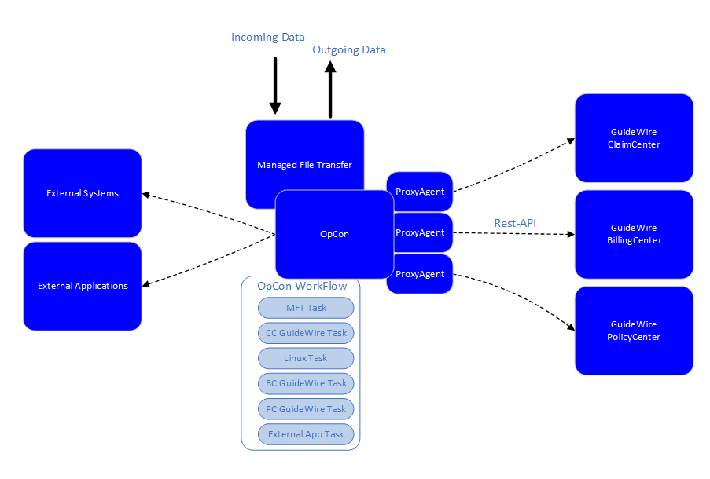

# SMA GuideWire Agent

The SMA GuideWire Agent, Version 22.0.0, is an OpCon agent that allows OpCon to schedule Batch Processes within the GuideWire PolicyCenter, BillingCenter and ClaimCenter environments.

The SMA GuideWire agent uses asynchronous calls supported by the REST API Framework to submit Batch Process requests and to track the status of the submitted requests. Available Batch Processes are retrieved from the PolicyCenter, BillingCenter and ClaimCenter environments and appended to a drop-down list allowing the user to select the appropriate process. If the Batch Process allows the specification of arguments, these arguments can be defined and will be submitted with the request.

The advantage of using OpCon to schedule the Batch Processes is that OpCon can co-ordinate task requirements across GuideWire Systems, non GuideWire systems and External Applications allowing the automation of dependent tasks within workflows.

