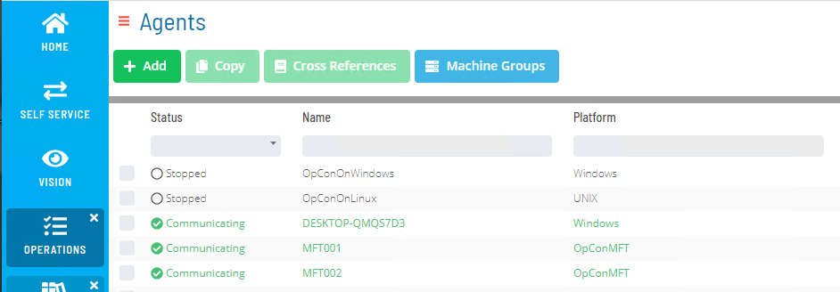
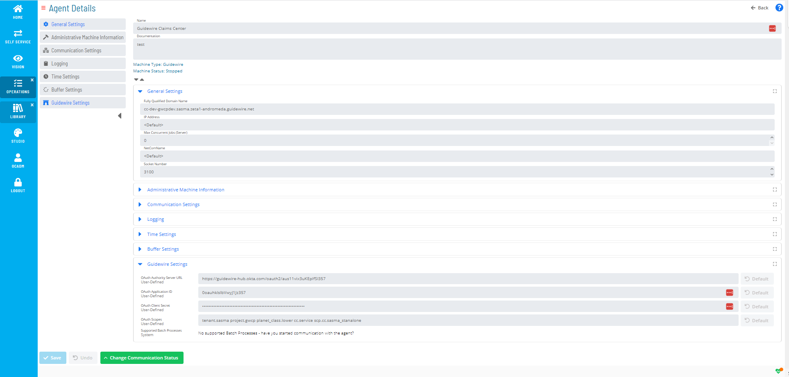

# GuideWire Agent Installation

>OGuideWire Requires OpCon version 22.8 or greater.

>***Before starting an installation, an updated OpCon License key including a GuideWire Agent type must be obtained. Failure to do this will result in a license 
Violation when the defined OpCon MFT agent is activated in opCon and will result in OpCon termination if the activated GuideWire Agent is not deactivated within
the specified time.***


The OpCon GuideWire environment consists of the AgentProxy that provides the communication link between OpCon and the GuideWire applications.

The AgentProxy is contained within the SMANetCom environment and is installed automatically when the core SMA OpCon component is installed. 

The AgentProxy uses the new SMANetCom Rest-API module and provides the communications link between OpCon and the GuideWire Rest-API. Currently, 
there is a one to one relationship between an OpCon environment and a GuideWire application, meaning a separate AgentProxy instance would need 
to be configured for each GuideWire application environment.

## Authentication
GuideWire uses OAuth which is an open standard authorization framework for token-based authorization on the internet. It acts as an intermediary on behalf of the end user, 
providing the third-party service with an access token that authorizes specific account information to be shared. The process for obtaining the token is called an authorization flow.

In order to authenticate with your GuideWireCloud instance, a GuideWireCloud OAuth account must first be created.

Consult GuideWire documentation or support to create the required account.

Once you have created the GuideWireCloud OAuth account you will have a set credentials containing the fields needed for OpCOn to communicate with the GuideWireCloud instance.

- Application ID
- Client Secret
- Auth Server URL

However, before setting up the OpCon GuideWire connection, the permission scopes allocated to OpCon must be defined.

### Configuring GuideWire Permission Scopes
This requires creating a YAML file containing the allocated permissions and storing it in your GuideWireCloud source repository.

Each Service Center will require it's own copy of this file, although the same file can be used for each service. 
For each Service Center, this file should be located in ***ServiceCenterName***/modules/configuration/config/integration/roles/. This directory should contain many 
other **.role.yaml** files for reference.

The file name should be a recognizable name without spaces or special characters and suffixed with **.role.yaml** (i.e. scp.cc.sasma_stanalone.role.yaml - see figure 1) .

The file contains permissable endpoints and must contain the **/systemtools/v1/\*\*** endpoint. 

```

name: scp.cc.sasma_stanalone
endpoints:
- endpoint: /claim/v1/**
  methods:
  - GET
  - POST
  - PATCH
  - DELETE
- endpoint: /admin/v1/**
  methods:
  - GET
  - POST
  - PATCH
  - DELETE
- endpoint: /async/v1/**
  methods:
  - GET
  - POST
  - PATCH
  - DELETE
- endpoint: /common/v1/**
  methods:
  - GET
  - POST
  - PATCH
  - DELETE
- endpoint: /systemtools/v1/**
  methods:
  - GET
  - POST
  - PATCH
  - DELETE
accessibleFields:
  "*":
    edit:
    - "*"
    view:
    - "*"

```
Figure 1 : Fully Permissive Role File Example

The file contains the following three major fields (Table 1)

Field                   | Description
----------------------- | -----------
**name**                | this is the value used as the filename without the .role.yaml suffix.
**endpoints**           | describes the the endpoint for which the subsequent methods are permitted (glob patterns are supported). See **endpoint** information (table 2).
**accessibleFields**    | this describes the specific fields which the CloudWireCloud API will return to OpCon. For specific details, reference the GuideWire Cloud documentation (figure 2 contains a default definition that should be used for proper OpCon integration).

Table 1 : role.yaml major values

```
accessibleFields:
  "*":
    edit:
    - "*"
    view:
    - "*"
```
Figure 2 : Definition for Proper OpCon integration.

Each endpoint must be separately defined within the endpoints section and contains the endpoint name as well as which methods are allowed.

Field                   | Description
----------------------- | -----------
**endpoint:**           | defines the endpoint values /admin/v1/\*\*, /async/v1/\*\*, /claim/v1/\*\*, /common/v1/\*\*, /systemtools/v1/\*\*,
**methods**             | defines the methods allowed on the endpoint DELETE, GET, PATCH, POST

Table 2 : role.yaml second level values

One the file has been created, it must be committed to your GuideWireCloud Repository. Remember that each Service Center that must be integrated with OpCon will need its own file.
Once the file has been committed, you will be all to reference the newly-created scope from within OpCon. 

Consult GuideWire documentation or support to commit the information into your GuideWireCloud Repository.   

## Agent Definition
Before a task can be selected, the agent definition for the connection to the GuideWire environment must be defined. It should be noted that a separate GuideWire agent must be defined for each Service Center that OpCon will connect to.

From Solution Manager, select **Library** and under the **Administration** menu select **Agents**.



Select **+ Add** to configure the new GuideWire Agent.

Enter a name for the agent and select the **Guidewire** item from the **Machine Type** drop-down list.

Open the **General Settings** sub-heading and enter the domain name of the GuideWireCloud Service Center which OpCon will be connecting to in the **Fully Qualified Domain Name** field. All other settings can be left as the default value.

Select the **Save** button.



After saving, a new a new sub-heading titled **Guidewire Settings** will be available. Expand this sub-heading to display four input and one informational field.

The GuideWire credentials returned following the **Authentication** step are entered into these fields.

Enter your GuideWireCloud credentials into the appropriate fields here.

Field                            | Value
-------------------------------- | -----------
**OAuth Authorize Server URL**   | the value returned when the GuideWireCloud OAuth account was created.
**OAuth Application ID**         | the value returned when the GuideWireCloud OAuth account was created.
**OAuth Client Secret**          | the value returned when the GuideWireCloud OAuth account was created.
**OAuth Scopes**                 | this consists of several names separated by spaces (example: tenant.sasma project.gwcp planet_class.lower cc.service scp.cc.sasma_stanalone)
 tenant name                     | your GuideWireCloud Tenant name (example: tenant.sasma)
 GuideWireCloud Project name     | your GuideWireCloud project name (example: project.gwcp)
 GuideWireCloud Planet Class     | your GuideWireCloud Planet Class (example: planet_class.lower)
 Service Center identifier       | the Service Center identifier to be associated with this agent. If, for example, this agent will be used to automate Claims Center, you should enter cc.service, or for Policy Center, pc.service. 
 The created scope file          | The scope file which you created earlier. Enter the name of the scope file .roles.yaml suffix (example: scp.cc.sasma_stanalone).
**Supported Batch Processes**    | Initially this field will contain **No supported Batch Processes - have you started communication with the agent?**

Table 3 : GuideWire Settings fields

Select the **Save** button.

After getting confirmation that the save was successful, mark the machine Up. 

After a short while (a page refresh might be necessary), you will see that the Supported Batch Processes line item has changed to display a list of all batch processes which the agent is capable of automating. This indicates successful completion of the OAuth configuration for your agent.
