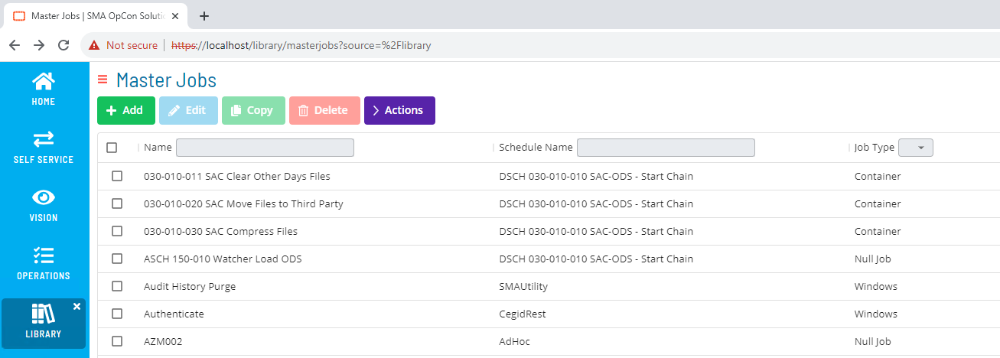
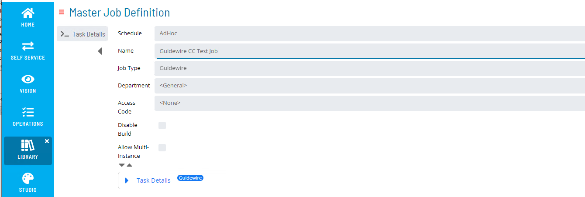
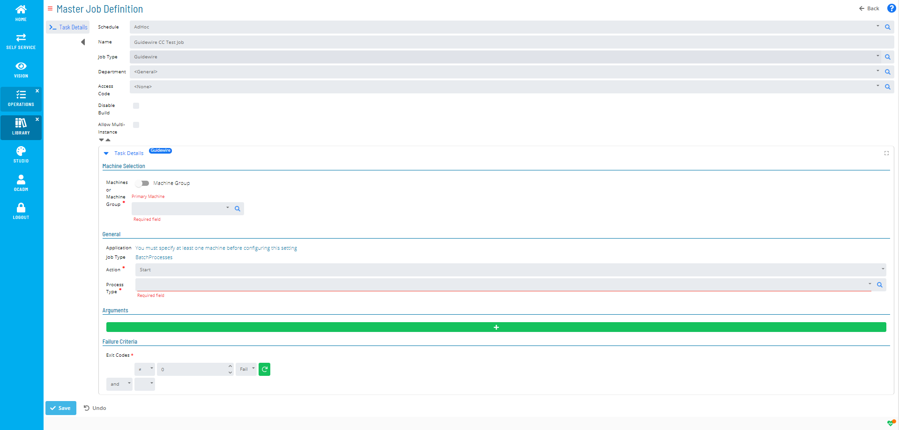
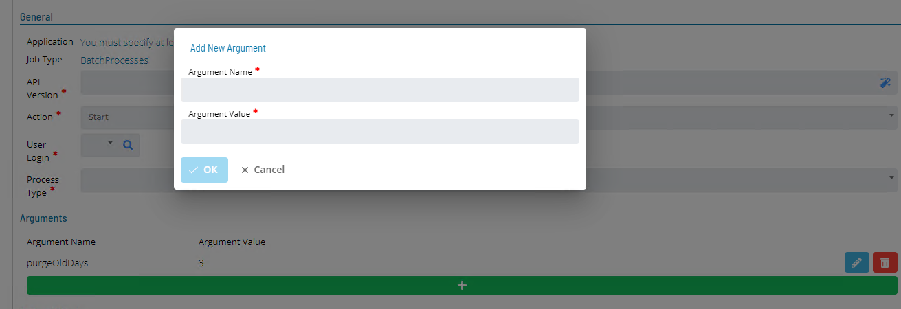

# GuideWire Agent ask Definition

GuideWire Task Definitions can only be created or modified using Solution Manager.

To create a new task, using Solution Manager select **Library** and from the **Administration** Menu select **Master Jobs**.
This will display the Master Jobs View.

Select the **+ Add** button to create a new task or use the **Name**, **Schedule Name** or **Job Type** filters to find an existing task definition. Once the task has been 
identified, select the task using the **Check Box** and then select **Edit**, **Copy** or **Delete** buttons perform an action on the task.

Select the associated Schedule from the **Schedule** drop-down list, enter a unique job name (within the associated schedule) in the **Name** field and select **Guidewire**
from the **Job Type** drop-down list. The **Task Details** section will reflect the selected Job Type **Guidewire**. 

## Task Details

Open the Task Details field.

Complete the required definitions in the **General** section.

Field                            | Value
-------------------------------- | -----------
**Machines or Machine Group**    | Select the required GuideWire Machine from the drop-down list (Currently Machine Group configurations is not supported).  
**Action**                       | Select the task action from the drop-down list (currently only Start and Stop actions supported).
**Process Type**                 | Select the required Batch Process from the drop-down list. The list of available Batch Processes is retrieved from the associated GuideWire environment.

## Arguments

Some Batch Processes support the capability to provide argument values override the default values Batch Process arguments at startup.
To define override values for the selected Batch Process, use the **Arguments** section.

Examples :
The **PurgeAsyncApiRequest** batch process supports an Argument Name **purgeDaysOld** which has an integer Argument Value.
The **DBConsistencyCheck** batch process supports an Argument Name of **tableNames** which has a string value containing the names of tables to check. Multiple names comma 
separated can entered **cc_activity,cc_address**. For more information on which arguments acn be provided consult the GuideWire Administration Guide associated with target 
GuideWire Environment. 

To add a supported argument, select the green (+) bar in the Arguments section and enter the Argument name and Argument Values.
Enter the name of the argument and the argument value and select **OK**. The argument information will then be displayed above the gree (+) bar.
Existing arguments can be modified or deleted by selecting the icon to the right of the entry in the argument list.

## Failure Criteria
Successful completion of the task results in a completion code of 0 being returned to OpCon. Any other value will result in the OpCon task being marked as failed. 
